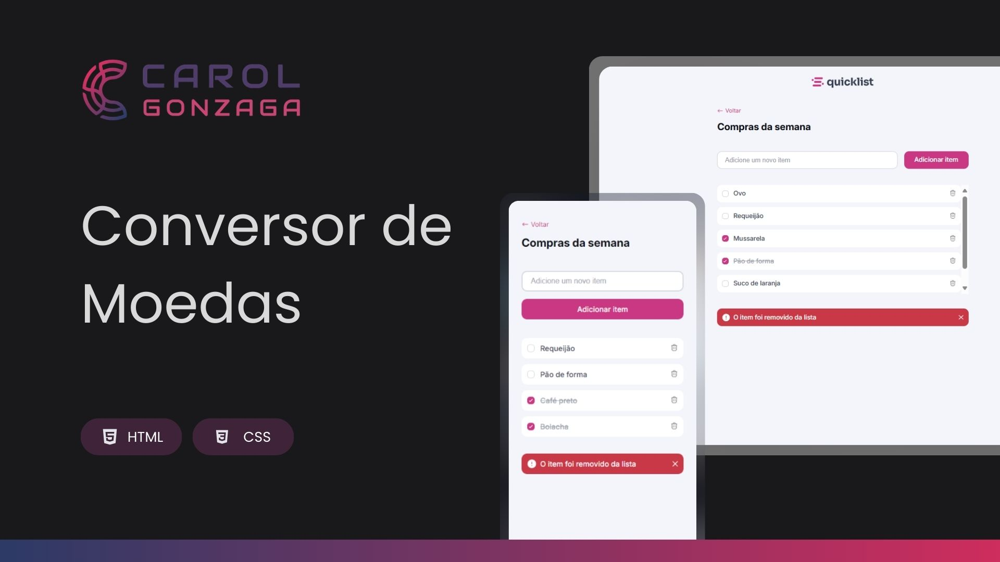

  

 

Uma aplicação de Lista de Compras com abordagem mobile-first e totalmente responsiva.

  <a href="#-tecnologias">Tecnologias</a>&nbsp;&nbsp;&nbsp;|&nbsp;&nbsp;&nbsp;<a href="https://carolgonzaga.github.io/lista-de-compras/">Acesse o Projeto</a>

 
 

  

 
 

## 🚀 Tecnologias

Esse projeto foi desenvolvido com as seguintes tecnologias:

- HTML5
- CSS3 (com custom properties e media queries)
- JavaScript (manipulação do DOM)

 
 

## 🎯 Objetivo

O objetivo deste projeto é praticar a manipulação de elementos HTML com JavaScript e aprimorar habilidades de responsividade e design de interfaces amigáveis.

 

A aplicação permite que o usuário:
- Adicione novos itens à lista de compras
- Marque/desmarque itens como concluídos com checkbox customizado
- Exclua itens individualmente com um botão de lixeira
- Visualize uma mensagem de alerta animada ao excluir um item
- Tenha uma experiência otimizada para dispositivos móveis (mobile-first)
